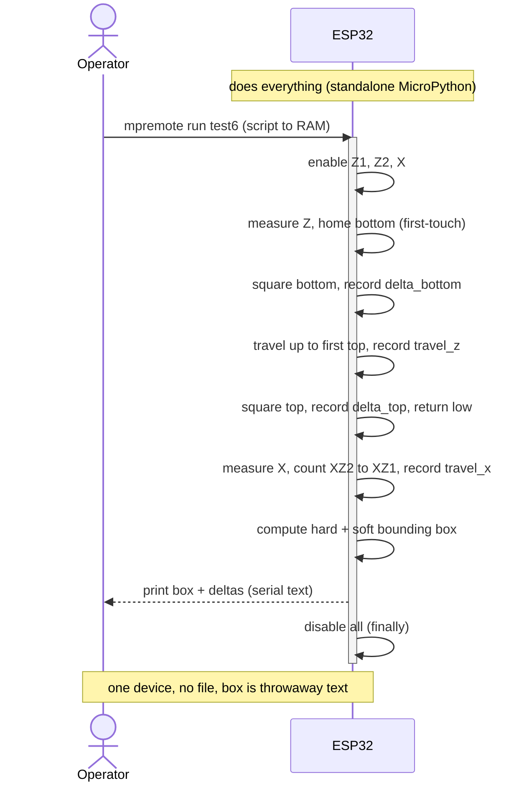
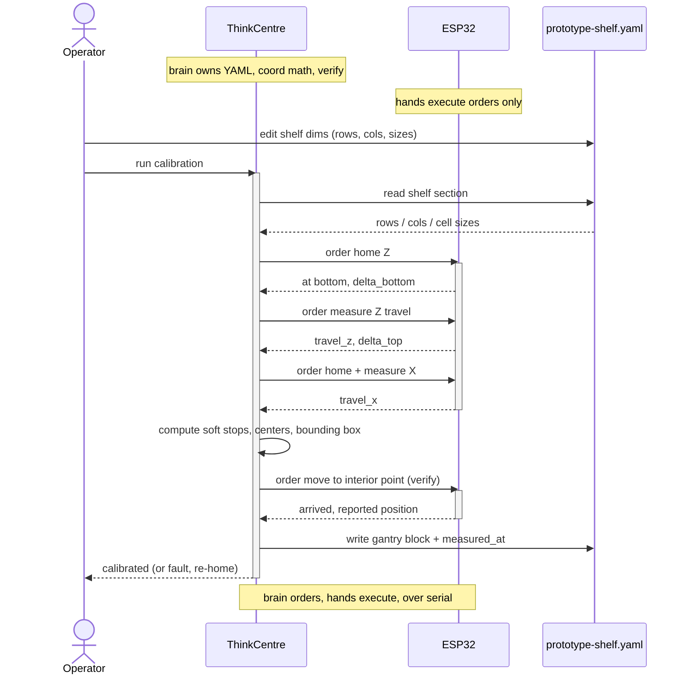

# S3T6 — Stage 1 vs Stage 2 (sequence diagrams)

## Stage 1 — Measurement half (all on the ESP32)

```mermaid
sequenceDiagram
    actor Op as Operator
    participant E as ESP32
    Note over E: does everything (standalone MicroPython)
    Op->>E: mpremote run test6 (script to RAM)
    activate E
    E->>E: enable Z1, Z2, X
    E->>E: measure Z, home bottom (first-touch)
    E->>E: square bottom, record delta_bottom
    E->>E: travel up to first top, record travel_z
    E->>E: square top, record delta_top, return low
    E->>E: measure X, count XZ2 to XZ1, record travel_x
    E->>E: compute hard + soft bounding box
    E-->>Op: print box + deltas (serial text)
    E->>E: disable all (finally)
    deactivate E
    Note over Op,E: one device, no file, box is throwaway text
```

## Stage 2 — Calibration function (ThinkCentre orchestrates the ESP32)

```mermaid
sequenceDiagram
    actor Op as Operator
    participant T as ThinkCentre
    participant E as ESP32
    participant Y as prototype-shelf.yaml
    Note over T: brain owns YAML, coord math, verify
    Note over E: hands execute orders only
    Op->>Y: edit shelf dims (rows, cols, sizes)
    Op->>T: run calibration
    activate T
    T->>Y: read shelf section
    Y-->>T: rows / cols / cell sizes
    T->>E: order home Z
    activate E
    E-->>T: at bottom, delta_bottom
    T->>E: order measure Z travel
    E-->>T: travel_z, delta_top
    T->>E: order home + measure X
    E-->>T: travel_x
    deactivate E
    T->>T: compute soft stops, centers, bounding box
    T->>E: order move to interior point (verify)
    activate E
    E-->>T: arrived, reported position
    deactivate E
    T->>Y: write gantry block + measured_at
    T-->>Op: calibrated (or fault, re-home)
    deactivate T
    Note over T,E: brain orders, hands execute, over serial
```
